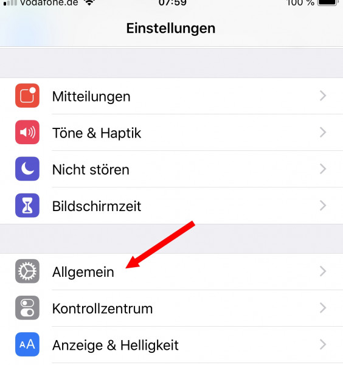
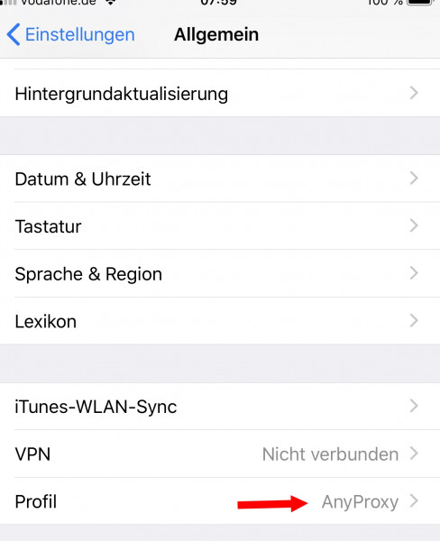
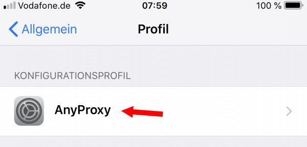
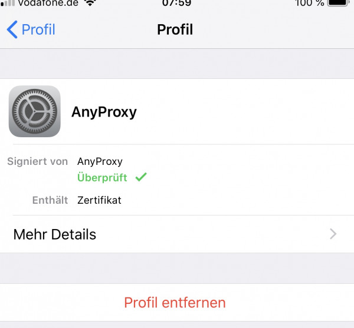
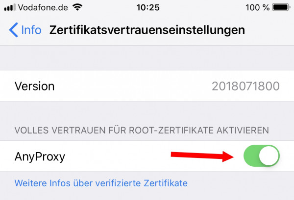
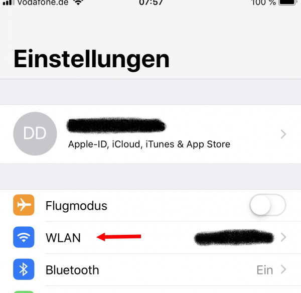
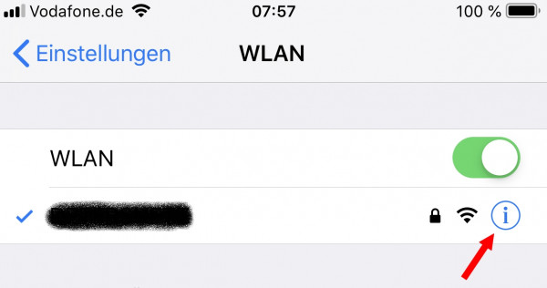
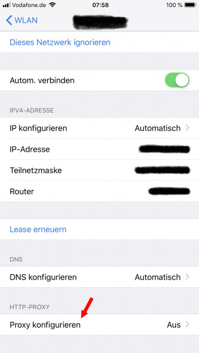
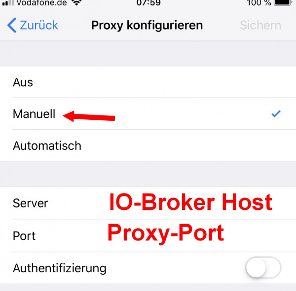
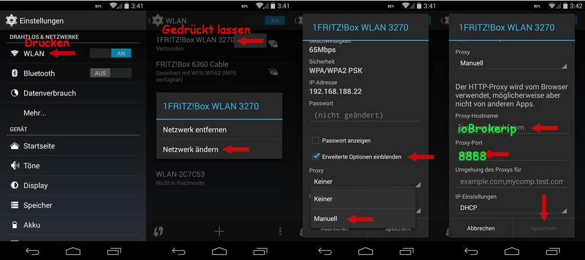

# Proxy instructions for mobile Phones

## iOS

**Important: The Proxy is called "NodeMITMProxyCA" and no longer "Anyproxy" since 3.0.0!**

https://youtu.be/bHaL9ftU2zc

### Install Certificate

### Enable Proxy

## Android

https://youtu.be/bHaL9ftU2zc?t=275

**Important: The Proxy is called "NodeMITMProxyCA" and no longer "Anyproxy" since 3.0.0!**

**Important: Some newer Android versions might NOT allow the self signed certificates anymore at all! So if you are sure you did anything correctly and it is still not working or only SSL errors are in the logs then please try an Android Emulator (see below)!**

### Install certificate

Depending on your Android version an installation of the Certificate for "VPN and Apps" OR "Wifi" is needed. AN easy way is to just install it twice (once for both modes) :-)

### Enable PROXY

### Detailed Step by Step Guide for using Proxy with Android and older App version

see [TuyaSync.pdf](https://raw.githubusercontent.com/Apollon77/ioBroker.tuya/master/TuyaSync.pdf)

A list of knwon compatible apps and versions can be found in [README.md](https://github.com/Apollon77/ioBroker.tuya#compatible-mobile-apps-and-versions) !

Thanks go to to HappyTeaFriend from ioBroker-Forum!

### Fallback Option if above do not work

This solution that works for user that also have a Windows computer was reported in [ioBroker Forum](https://forum.iobroker.net/topic/16103/aufruf-neuer-adapter-iobroker-tuya-wlan-devices-tuya-smart-life-und-andere/83) and is working wth an Android Simulator.
A second Andreoid Emulator approach is described at https://forum.iobroker.net/topic/23431/aufruf-tuya-adapter-tests-verschl%C3%BCsselte-ger%C3%A4te/19

https://youtu.be/bHaL9ftU2zc?t=157

