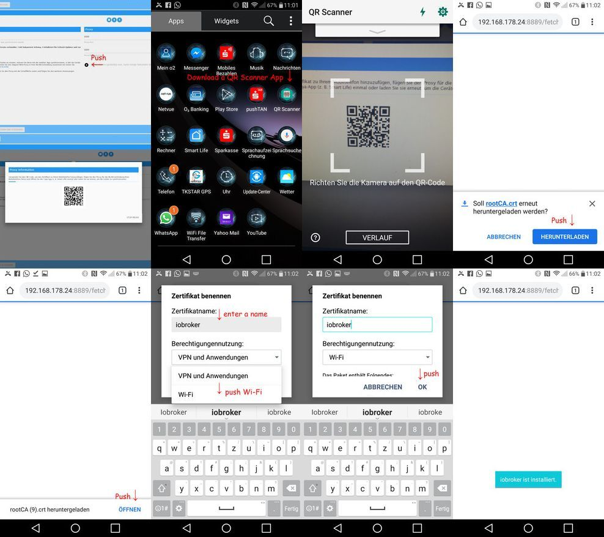

# Proxy instructions for mobile Phones

## iOS

https://youtu.be/bHaL9ftU2zc

### Install Certificate

### Enable Proxy

## Android

https://youtu.be/bHaL9ftU2zc?t=275

### Install certificate

Depending on your Android version an installation of the Certificate for "VPN and Apps" OR "Wifi" is needed. AN easy way is to just install it twice (once for both modes) :-)

### Enable PROXY

### Fallback Option if above do not work

This solution that works for user that also have a Windows computer was reported in [ioBroker Forum](https://forum.iobroker.net/topic/16103/aufruf-neuer-adapter-iobroker-tuya-wlan-devices-tuya-smart-life-und-andere/83) and is working wth an Android Simulator.
A second Andreoid Emulator approach is described at https://forum.iobroker.net/topic/23431/aufruf-tuya-adapter-tests-verschl%C3%BCsselte-ger%C3%A4te/19

https://youtu.be/bHaL9ftU2zc?t=157
